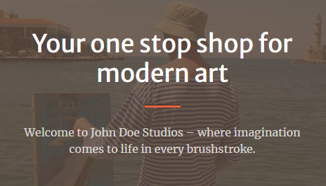
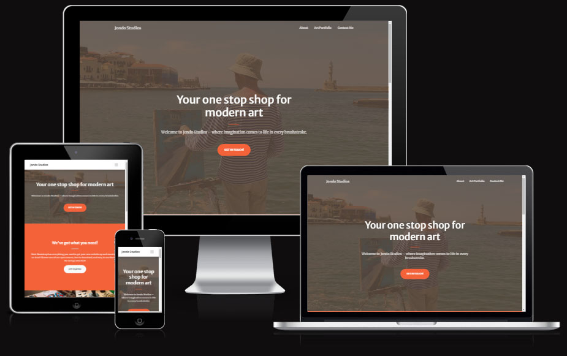
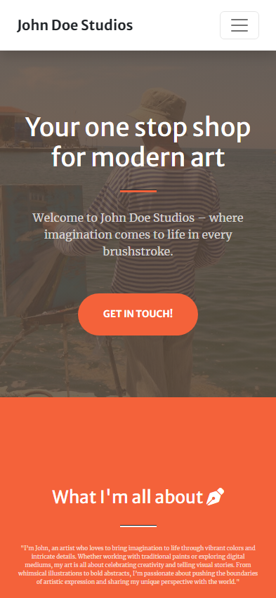
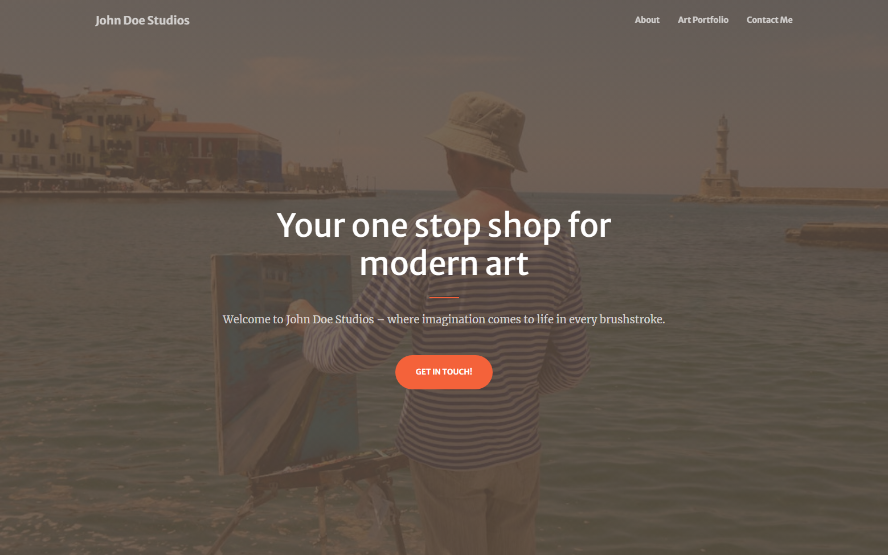
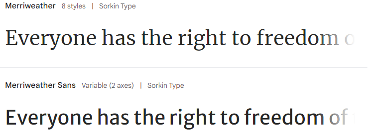

---

# *John Doe Studios*

John Doe Studios is the online representation of the famous Greek painter. Anyone interested can see some of his artwork available to buy.

John Doe Studios can be accessed by this [link](https://barkode.github.io/art-gallery-team-project/)

---
## User Stories

### First Time Visitor Goals:

* As a First Time Visitor, I want to easily understand the main purpose of the site and also if I have reached to the needed place for me. So I can read what site is about immediately at the top of the screen.
* As a First Time Visitor, I want to be able easily navigate through the website pages, so I can find the content required. It's all in one place in compact size on the screen.
* As a First Time Visitor, I want to easy start using functionality.

### Returning Visitor Goals:

* As a Returning Visitor, I want to pass through the gallery if I didn't yet.
* As a Returning Visitor, I want to see contacts.

### Frequent Visitor Goals:

* As a Frequent User, I want to have possibility write a request to the author.

## Features

+ ### Home Page

  - Represent:
    * Logo
    * Decoration image
    * Gallery
    * Contact form
    * Footer

- John Doe Studios site is responsive.

- On mobile devices: content placed has "narrow style".

  * On tablet or laptop/desktop: when user see from high resolution device content becomes wider

---
## Technologies Used

- [HTML](https://developer.mozilla.org/en-US/docs/Web/HTML) - was used as the foundation of the site.
- [CSS](https://developer.mozilla.org/en-US/docs/Web/css) - was used to add the styles and layout of the site.
- [JavaScript](https://developer.mozilla.org/en-US/docs/Web/JavaScript) - was used to create interactivity with the user.

## Frameworks, Libraries & Programes Used
- [Trello](https://trello.com/) - Workspace Trello was used as a dashboard for managing tasks.
- [Bootstrap 5](https://getbootstrap.com/) - Bootstrap is a powerful, feature-packed frontend toolkit used in this project.
- [Google fonts](https://fonts.google.com) - Google fonts were used to import the 'Carme' font into the HTML file which is used on all pages throughout the project
- [Font Awesome](https://fontawesome.com) - Font Awesome was used on all footer of the pages throughout the website to add icon for aesthetic and UX purposes.
- [Git](https://gitpod.io) - Git was used for version control by utilizing the Gitpod terminal to commit to Git and Push to GitHub.
- [GitHub](https://github.com) - GitHub is used for teamwork and to store the projects code after being pushed from Git.

---
## Design

### Color Scheme

- Сolors of the John Doe Studios site are neutral. Buttons colors were choosen as the best practice.

### Typography

- Merriweather Google Font family was used as the main font of the website in order to increase readability and beautyfication of the content on the pages.

### Wireframes

#### Mobile devices

- [Home Page. Mobile Screen](docs/basic-wireframe.jpg)

#### Tablets/Desktop

- [Home Page. Tablet/Desktop Screen](docs/basic-wireframe.jpg)

---

## Working process

In our project we used Agile methodology and worked in Trello as a dashboard for implement this approach

- [Trello - working in a team](docs/trello.png)

## Deployment

### Deployment to GitHub Pages

- The site was deployed to GitHub pages. The steps to deploy are as follows: 
  - In the [GitHub repository](https://github.com/barkode/art-gallery-team-project), navigate to the Settings tab 
  - From the source section drop-down menu, select the **Main** Branch, then click "Save".
  - The page will be automatically refreshed with a detailed ribbon display to indicate the successful deployment.

The live link can be found [here](https://barkode.github.io/art-gallery-team-project/)

### Local Deployment

In order to make a local copy of this project, you can clone it.
In your IDE Terminal, type the following command to clone my repository:

- `git clone https://github.com/barkode/art-gallery-team-project.git`

- Alternatively, if you use Gitpod, you can [click here](https://gitpod.io/#https://github.com/barkode/art-gallery-team-project), which will start the Gitpod workspace for you.

---

## Future features
- add custom 404 page;

---
## Credits

## Media
  - [Used Bootstrap template](https://startbootstrap.com/theme/creative)

  - [Hero Image](https://www.pexels.com/photo/man-in-white-and-blue-striped-long-sleeved-shirt-painting-near-seashore-896108/) - Heinz Klier   

### Gallery

  - [https://www.pexels.com/photo/blue-and-grey-paint-brush-stroke-1537334/](https://www.pexels.com/photo/blue-and-grey-paint-brush-stroke-1537334/ "‌")
  - [https://www.pexels.com/photo/photo-of-abstract-painting-1843716/](https://www.pexels.com/photo/photo-of-abstract-painting-1843716/ "‌")
  - [https://www.pexels.com/photo/yellow-white-and-blue-abstract-painting-4371628/](https://www.pexels.com/photo/yellow-white-and-blue-abstract-painting-4371628/ "‌")
  - [https://www.pexels.com/photo/abstract-painting-1418595/](https://www.pexels.com/photo/abstract-painting-1418595/ "smartCard-inline")
  - [https://www.pexels.com/photo/photo-of-abstract-painting-on-canvas-1812960/](https://www.pexels.com/photo/photo-of-abstract-painting-on-canvas-1812960/ "smartCard-inline")
  - [https://www.pexels.com/photo/multicolored-abstract-painting-1012982/](https://www.pexels.com/photo/multicolored-abstract-painting-1012982/ "‌")
  - [https://www.pexels.com/photo/green-and-red-abstract-painting-1070534/](https://www.pexels.com/photo/green-and-red-abstract-painting-1070534/ "‌")
  - [https://www.pexels.com/photo/abstract-painting-1109354/](https://www.pexels.com/photo/abstract-painting-1109354/ "‌")
  - [https://www.pexels.com/photo/blue-white-red-and-yellow-abstract-painting-1143758/](https://www.pexels.com/photo/blue-white-red-and-yellow-abstract-painting-1143758/ "‌")
  - [https://www.pexels.com/photo/photo-of-paint-splatter-artwork-1000366/](https://www.pexels.com/photo/photo-of-paint-splatter-artwork-1000366/ "‌")
  - [https://www.pexels.com/photo/red-and-yellow-floral-textile-1787243/](https://www.pexels.com/photo/red-and-yellow-floral-textile-1787243/ "smartCard-inline")
  - [https://www.pexels.com/photo/green-blue-and-red-abstract-painting-1799901/](https://www.pexels.com/photo/green-blue-and-red-abstract-painting-1799901/ "smartCard-inline")

Link to author:
[https://www.pexels.com/@steve/highlights/](https://www.pexels.com/@steve/highlights/ "smartCard-inline")

- [Icons](https://www.flaticon.com/free-icon/art-and-design_3528221?term=art&page=1&position=31&origin=search&related_id=3528221 "‌")

- Snippet code: from Code institute Love Running project

- [Profile Image](https://www.pexels.com/photo/a-bearded-man-in-a-checkered-shirt-and-a-cap-standing-on-a-field-26222877/ "smartCard-inline") - By Zaur Takhgiriev

+ #### Tools

    - [Adobe Photoshop](https://www.adobe.com) was used to resize and crop images.
    - [TinyPNG](https://tinypng.com/) was used to smart WebP, PNG and JPEG compression for faster Websites.
    - [Squoosh](https://squoosh.app/) - Convert and optimize pictures
---
